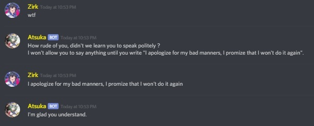

# Atsuka
A Discord bot that order you to apologize if you say bad things 
If you keep saying bad things, the bot will attempt to kick you (make sure it have the permissions) 
The bot will also report in a channel all messages sent in PM, in case angry people want to bad mouth her

## How to use it
Clone the bot and compile it using Visual Studio 
Create a Keys folder need your executable 
Inside it, create a keys.txt file with the following values inside:
- token: Bot token
- perspectiveToken: Token from Google Perspective
- googleAPIjson: Location of the JSON file used by Google Translate
- reportChan (optional): Channel where messages are reported
- guildId (optional): Guild where reportChan is
  

